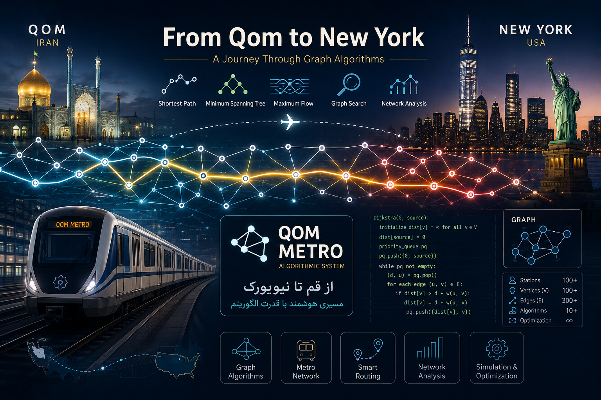

# 🚇 From Qom to New York

<div align="center">

### **Metro Network Simulation & Algorithmic Analysis System**




*A modern C++ implementation of classical graph algorithms through a unified metro management system.*


---

**Algorithm Design Final Project**

**Bu-Ali Sina University**

Spring 1405 (2026)

</div>

---

## 📖 Overview

**From Qom to New York** is a complete metro management and analysis system built around the metro network of **Qom, Iran**.

Instead of implementing each algorithm as an isolated assignment, the entire project is designed as **one integrated software system** where every feature shares the same graph infrastructure and architecture.

The project gradually evolves through five development rounds, introducing increasingly advanced graph algorithms and data structures while preserving a clean and extensible design.

---

## ✨ Highlights

- 🚇 Real-world metro network modeling
- 🧩 Object-Oriented architecture
- 🏛️ SOLID design principles
- 🔌 Interface-driven design
- 📦 Modular architecture
- ⚡ Classical graph algorithms
- 📊 Performance analysis
- 🧪 Testable components
- 📄 Technical documentation
- 🔨 Built with modern C++ & CMake

---

# 🏗 Architecture

The project follows a layered architecture.

```
                 +------------------+
                 |   MetroSystem    |
                 +------------------+
                          |
          +---------------+---------------+
          |               |               |
          ▼               ▼               ▼
 RoutingService   NetworkService   AnalysisService
          |               |               |
          +---------------+---------------+
                          |
                     Algorithms
                          |
                          ▼
                        IGraph
                          |
                          ▼
                         Graph
                          |
                          ▼
                  Stations & Edges
```

Every algorithm works on the same graph abstraction, making the system extensible without modifying existing implementations.

---

# 🚀 Features

## Round 1 — Core Graph System

- Graph modeling
- BFS
- DFS
- Dijkstra
- Reachability analysis

---

## Round 2 — Network Infrastructure

- Prim
- Kruskal
- Union-Find
- Bellman-Ford
- DAG Shortest Path

---

## Round 3 — Daily Metro Operations

- Interval Scheduling
- Priority Queue
- Passenger Simulation
- Operational Statistics

---

## Round 4 — Network Analysis

- Floyd-Warshall
- Maximum Flow
- Articulation Points
- Bridges
- Levenshtein Search

---

## Round 5 — Innovation

Current planned implementation:

- ⭐ A* Search
- Performance comparison with Dijkstra

---

# 📂 Project Structure

```
QomMetro/
│
├── include/
├── src/
├── data/
├── docs/
├── tests/
├── output/
└── CMakeLists.txt
```

The internal architecture is documented separately in:

```
docs/Architecture.md
```

---

# 🧠 Algorithms

| Category | Algorithms |
|----------|------------|
| Graph Traversal | BFS, DFS |
| Shortest Path | Dijkstra, Bellman-Ford, Floyd-Warshall, DAG Shortest Path, A* |
| Minimum Spanning Tree | Prim, Kruskal |
| Flow Algorithms | Ford-Fulkerson, Edmonds-Karp |
| Connectivity | Articulation Points, Bridges |
| Searching | Levenshtein Distance |
| Scheduling | Interval Scheduling |
| Data Structures | Union-Find, Priority Queue, Heap |

---

# ⚙️ Technologies

- C++17
- CMake
- STL
- nlohmann/json
- Object-Oriented Programming
- SOLID Principles

---

# ▶️ Build

```bash
git clone <repository-url>

cd QomMetro

mkdir build
cd build

cmake ..

cmake --build .

./QomMetro
```

---

# 📚 Documentation

The repository contains detailed documentation including

- Architecture
- UML Diagrams
- Technical Report
- Complexity Analysis
- Algorithm Comparisons

All documentation can be found inside the **docs/** directory.

---

# 🧪 Testing

Each module is tested independently.

```
tests/

GraphTests
RoutingTests
MSTTests
FlowTests
SimulationTests
```

The goal is to verify correctness while keeping implementations independent and reusable.

---

# 🎯 Design Goals

This project emphasizes software engineering as much as algorithm design.

Core goals include:

- Maintainability
- Extensibility
- Readability
- Reusability
- Performance
- Clean Architecture

---

# 📈 Future Improvements

- Bidirectional Dijkstra
- Contraction Hierarchies
- ALT Algorithm
- Live Traffic Routing
- GUI Visualization
- Interactive Metro Map
- Benchmark Suite

---

# 📄 License

This repository is intended for educational purposes as part of the Algorithm Design course.

---

<div align="center">

**Designed & Developed with ❤️ using Modern C++**

*"Good algorithms solve problems. Great software makes them reusable."*

</div>